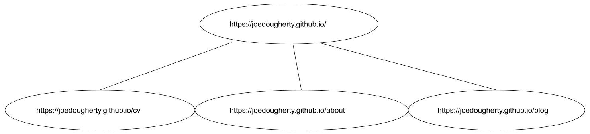

===============================================
A Practical Application of Breadth-first Search
===============================================

-----------------------
The Motivating Question
-----------------------

*How can we visit all the interconnected pages on a given site?*

One way to model this problem is to consider a website as a kind of graph. 

Imagine that we are going to visit a site: https://joedougherty.github.io.

.. image:: assets/jd-index.png

This is a small site with a simple structure. 

-----

If we think of **https://joedougherty.github.io** as the root of the graph, we can imagine the other pages as its children nodes. 

There are a `few ways <https://en.wikipedia.org/wiki/Tree_traversal>`_ to traverse graphs. In this case, **Breadth-first Search** is a natural fit. 

According to the `Wikipedia page <https://en.wikipedia.org/wiki/Breadth-first_search>`_: *"It starts at the tree root ... and explores all of the neighbor nodes at the present depth prior to moving on to the nodes at the next depth level."*

Looking at the graphical representation above, picture:

+ starting at **https://joedougherty.github.io**
+ visiting **https://joedougherty.github.io/cv**
+ visiting **https://joedougherty.github.io/about**
+ visiting **https://joedougherty.github.io/blog**

-----

``Spider`` is our crawler class. The crawling process is kicked off with ``.weave()``. Let's look at an example implementation from Wikipedia and see how ``Spider`` implements this algorithm across a few methods that cooperate with one another.

`Wikipedia Pseudocode <https://en.wikipedia.org/wiki/Breadth-first_search#Pseudocode>`_:

.. code-block:: 

	1  procedure BFS(G, root) is
	2      let Q be a queue
	3      label root as discovered	
	4      Q.enqueue(root)			                              
	5      while Q is not empty do
	6          v := Q.dequeue()
	7          if v is the goal then
	8              return v
	9          for all edges from v to w in G.adjacentEdges(v) do
	10             if w is not labeled as discovered then
	11                 label w as discovered
	12                 w.parent := v
	13                 Q.enqueue(w)

Breadth-first Search:

**A**. starts at the root node (lines 3,4)

**B**. discovers neighboring nodes (lines 9-13)

**C**. proceeds by visiting them and continuing this process until there are no new nodes left to discover and visit (line 5)

It is important to note that we are not searching for a specific node in this case. We want to visit every possible node. As such, we do not specify a stop condition (as in lines 7-8 above).

Given that there's no stop condition, we'll explore the graph until the visit queue is empty.

-----

Let's look at how the BFS algorithm is implemented in our ``Spider`` object.

**A**: We enqueue the **seed_urls** specified in the config file. This occurs in the ``.weave()`` method.

The first **seed_url** is the root of the graph.

.. code-block:: python

    def weave(self):
        for seed_url in self.cfg.seed_urls:
            self.visit_queue.append(Link(None, seed_url, None, cfg=self.cfg))

        try:
            while self.visit_queue:
                self.visit(self.visit_queue.popleft())
        finally:
            self.session.close()

            self.cleanup()

            self.status_logger.info("Crawling complete.")

Here's what it looks like when we ``.visit()`` a link:

.. code-block:: python

    def visit(self, link):
        self.pre_visit_hook(link)

        self.status_logger.info("Visiting: {}".format(link.href))

        self.visited_urls.add(link.href)
        
        resp = self.session.get(link.href)

        gathered_links = self.gather_links(resp.content, link.href)

        self.status_logger.info("=> Checking {} links...".format(len(gathered_links)))

        packaged_links = [(self.session, link) for link in gathered_links]

        with concurrent.futures.ThreadPoolExecutor(max_workers=self.max_workers) as exe:
            for result in exe.map(check_link, packaged_links):
                self._update(result)

A few points worth noting here:

+ the ``self.gather_links()`` method is our implementation of the pseudocode's ``G.adjacentEdges(v)``
+ The use of ``concurrent.futures.ThreadPoolExecutor`` here lets us spawn up to ``self.max_workers`` to check multiple links at the same time.
+ The ``._update()`` method keeps track of checked links, broken links, and links that threw exceptions. It is also where new pages are added to the ``visit_queue``.

The iterator returned by ``exe.map`` retains the original order of the iterable. If I understand this correctly, the calls to ``check_link`` happen concurrently, but the calls to ``._update()`` happen one-by-one after the threads have returned. Since the calls to ``._update()`` are sequential, there is no need to obtain / release locks on the data structures that maintain which links have been visited, are broken, threw exceptions, etc. 

**B**: Discovering the nearest neighbors is achieved with ``gather_links()``:

.. code-block:: python

    def gather_links(self, markup, current_url):
        gathered_links = list()

        for elem in BeautifulSoup(markup, "html.parser").find_all("a"):
            try:
                href = elem["href"]
            except KeyError:
                # Skip any <a> tags missing the "href" attribute.
                continue

            if href != current_url and self.keep_link(href):
                gathered_links.append(
                    Link(current_url, href, elem.text, cfg=self.cfg)
                )

        return gathered_links
    

If an element meets these conditions, it is added to the list:

+ element must have the ``href`` attribute 
+ ``href`` must not be the current url (prevent infinite ``.visit()`` loops)
+ ``href`` must pass ``keep_link()`` (link can't be broken, a link that threw an exception, or a link that has been visited already):

.. code-block:: python

    def keep_link(self, href):
        if any(
            (
                href in self.broken_urls,
                href in self.exception_urls,
                href in self.visited_urls,
            )
        ):
            return False
        else:
            return True
        

As long as a link is internal (``checked_link.worth_visiting == True``) and it hasn't been visited yet, it is appended to visit_queue.

**C**: The process continues until the visit_queue is empty. 

.. code-block:: python

    #
    # This is an excerpt from .weave(), as per above
    #

    while self.visit_queue:
        self.visit(self.visit_queue.popleft())

Though our implementation is distributed across a few methods, we can see that all the parts are here and working together.
